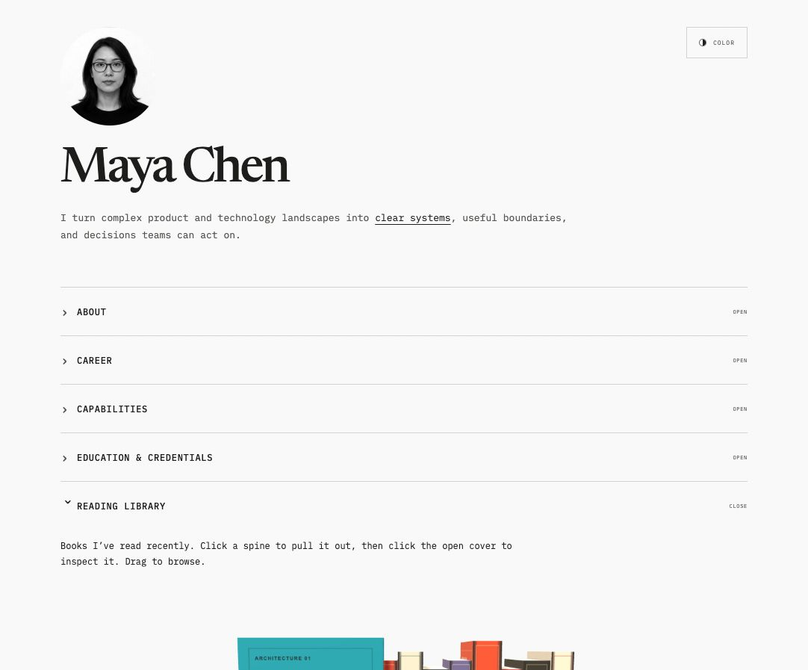

# Cursor & Covers

An open-source editorial portfolio starter with two playful interactions: a portrait that follows the cursor and a responsive 3D bookshelf you can browse, open, rotate, and zoom.

[View the live demo](https://abd-salam-shaikh.github.io/cursor-and-covers/)



The included person, career history, organizations, books, contact details, and portrait are fictional placeholders. Replace them with your own content before publishing.

## Features

- Nine-direction cursor-following portrait with preloaded frames
- Color and monochrome themes while book artwork stays vivid
- Responsive Three.js bookshelf for mouse, touch, and keyboard input
- Click-to-pull book transition, followed by an orbitable detail view
- Drag to rotate, scroll or pinch to zoom, and Escape to return
- Accessible accordion sections and reduced-motion support
- Procedurally generated demo covers, so the starter ships without copyrighted book artwork

## Quick start

```bash
npm install
npm run dev
```

Create a production build with:

```bash
npm run build
```

## Deployment

Pushes to `main` are deployed automatically to GitHub Pages by the workflow in `.github/workflows/deploy-pages.yml`. If you fork the project or rename the repository, update `base` in `vite.config.ts` to match the repository name and enable **GitHub Actions** as the Pages source in the repository settings.

## Customize it

- Edit the profile, career entries, credentials, and books in `src/App.tsx`.
- Adjust typography, colors, spacing, and responsive behavior in `src/styles.css`.
- Tune shelf geometry, materials, camera behavior, and motion in `src/ThreeShelf.tsx`.
- Replace the nine files in `public/assets/portrait/frames/` with consistently cropped images of your subject.

Portrait frames must be named `center.jpg`, `left.jpg`, `right.jpg`, `up.jpg`, `down.jpg`, `up-left.jpg`, `up-right.jpg`, `down-left.jpg`, and `down-right.jpg`. Keep the face aligned and the canvas dimensions identical across every frame for a smooth result.

## Credits

The cursor portrait interaction was inspired by [kylan02/face_looker](https://github.com/kylan02/face_looker). The bookshelf interaction was inspired by Mint's [Complete Shelf](https://github.com/mintdotgg/mint-playground/tree/main/experiences/complete-shelf). See [ACKNOWLEDGEMENTS.md](ACKNOWLEDGEMENTS.md) for details.

The fictional placeholder portrait was generated specifically for this starter and does not depict a real person.

## License

[MIT](LICENSE)
